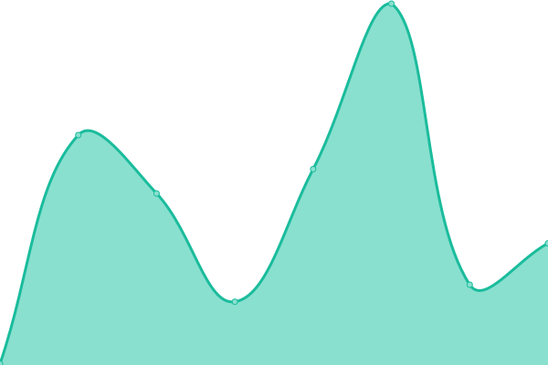
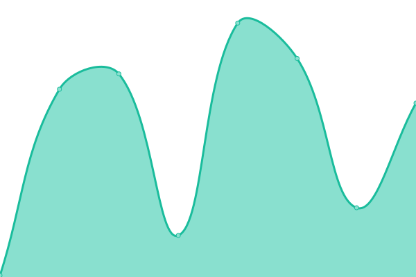

# [📈 Live Status](https://RavelloH.github.io/sitemonitor): <!--live status--> **🟧 Partial outage**

This repository contains the open-source uptime monitor and status page for [RavelloH](ravelloh.github.io), powered by [Upptime](https://github.com/upptime/upptime).

With [Upptime](https://upptime.js.org), you can get your own unlimited and free uptime monitor and status page, powered entirely by a GitHub repository. We use [Issues](https://github.com/RavelloH/sitemonitor/issues) as incident reports, [Actions](https://github.com/RavelloH/sitemonitor/actions) as uptime monitors, and [Pages](https://RavelloH.github.io/sitemonitor) for the status page.

<!--start: status pages-->
<!-- This summary is generated by Upptime (https://github.com/upptime/upptime) -->
<!-- Do not edit this manually, your changes will be overwritten -->
<!-- prettier-ignore -->
| URL | Status | History | Response Time | Uptime |
| --- | ------ | ------- | ------------- | ------ |
|  [GithubSite](https://ravelloh.github.io) | 🟩 Up | [github-site.yml](https://github.com/RavelloH/sitemonitor/commits/HEAD/history/github-site.yml) | 

 84ms
     
 | 

<a href="https://RavelloH.github.io/sitemonitor/history/github-site">100.00%</a>
    

|  [GiteeSite](https://ravelloh.gitee.io) | 🟩 Up | [gitee-site.yml](https://github.com/RavelloH/sitemonitor/commits/HEAD/history/gitee-site.yml) | 

 1504ms
     
 | 

<a href="https://RavelloH.github.io/sitemonitor/history/gitee-site">98.32%</a>
    

|  [JsSite](https://ravelloh.js.org) | 🟩 Up | [js-site.yml](https://github.com/RavelloH/sitemonitor/commits/HEAD/history/js-site.yml) | 

 178ms
     
 | 

<a href="https://RavelloH.github.io/sitemonitor/history/js-site">100.00%</a>
    

|  [TestSite](http://web1671.hao321.ml) | 🟥 Down | [test-site.yml](https://github.com/RavelloH/sitemonitor/commits/HEAD/history/test-site.yml) | 

 1551ms
     
 | 

<a href="https://RavelloH.github.io/sitemonitor/history/test-site">97.52%</a>
    

|  [TencentSite](https://website-0ggrccba61ac6225-1304791521.tcloudbaseapp.com) | 🟩 Up | [tencent-site.yml](https://github.com/RavelloH/sitemonitor/commits/HEAD/history/tencent-site.yml) | 

 1357ms
     
 | 

<a href="https://RavelloH.github.io/sitemonitor/history/tencent-site">99.62%</a>
    

|  [CNAME](https://ravello-h.github.io) | 🟩 Up | [cname.yml](https://github.com/RavelloH/sitemonitor/commits/HEAD/history/cname.yml) | 

 174ms
     
 | 

<a href="https://RavelloH.github.io/sitemonitor/history/cname">100.00%</a>
    

|  [StudioSite](https://xeocnet-studio.github.io) | 🟩 Up | [studio-site.yml](https://github.com/RavelloH/sitemonitor/commits/HEAD/history/studio-site.yml) | 

 86ms
     
 | 

<a href="https://RavelloH.github.io/sitemonitor/history/studio-site">100.00%</a>
    

<!--end: status pages-->

[**Visit our status website →**](https://RavelloH.github.io/sitemonitor)

## 📄 License

- Powered by: [Upptime](https://github.com/upptime/upptime)
- Code: [MIT](./LICENSE) © [RavelloH](ravelloh.github.io)
- Data in the `./history` directory: [Open Database License](https://opendatacommons.org/licenses/odbl/1-0/)
